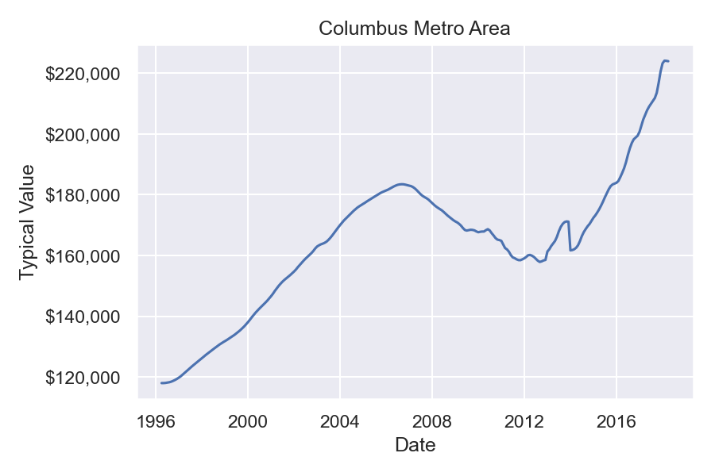
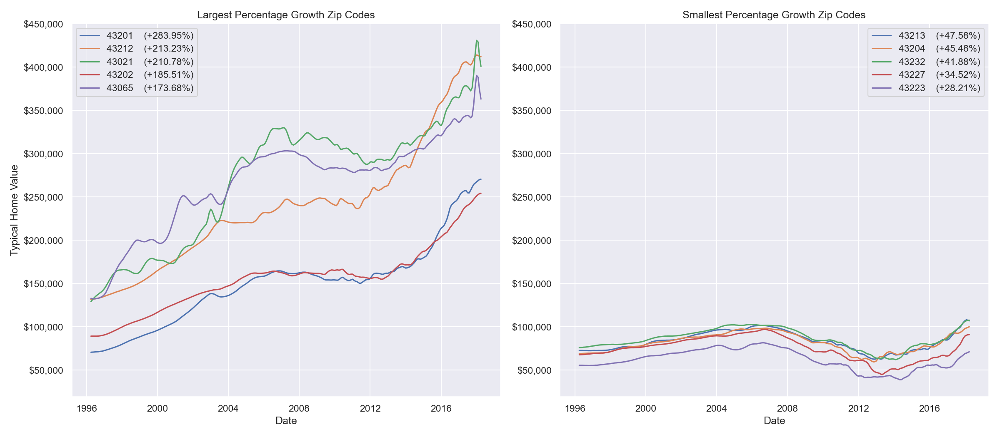

# Real Estate Investing - Columbus, OH
Student name: T.J. Kyner \
Student pace: Full time \
Instructor: Abhineet Kulkarni \
Cohort: 040521

## Project Overview
### Data Source
Zillow, one of the top real estate listing platforms in the United States, provides access to a variety of data through its research portal and associated APIs. The data used in this project (`zillow_data.csv`) is sourced from the [research portal](https://www.zillow.com/research/data/) and includes the monthly typical home prices of all homes (inclusive of single-family homes, condominiums, and co-operatives homes) per zip code. 

### Business Problem
The goal of this project is to act as a consultant to a fictional real estate invement firm and provide an answer to the following question:
> What are the top five best zip codes for us to invest in?

Specifically for this project, the focus will revolve around investment opportunities in **Columbus, OH**. The forecasted five-year return on investment (ROI), defined as the predicted percentage growth of the typical home value in a Columbus metro area zip code in five years, will serve as the evaluation metric for determing which zip codes to recommend.

### Repository Structure
```
├── data/
│    ├── fips_county_level.csv
│    ├── fips_state_level.csv
│    ├── geojson_ohio_zipcodes.json
│    ├── geojson_counties_fips.json
│    └── zillow_data.csv               # Median house prices
│
├── images/          # Exported images of plots
├── submissions/     # Files used for the project submissions
├── .gitignore
├── LICENSE
├── README.md
└── notebook.ipynb   # Jupyter notebook containing the analysis
```

## Data Preprocessing
In addition to generating summary information, investigating missing data, and modifying column names and orders, there were two key adjustments made during the preprocessing phase of this project:
1. Melting the data
2. Adding FIPS Codes

### Melting the data
Transforming data from wide format (where dates are represented as their own columns) to long format (where a single column holds different date values) is a process known as 'melting' the data. While wide format is useful for reading purposes, long format is much more conducive for visualizing and analyzing the data.

The function to perform this action is below:
```python
def melt_data(df):
    '''Transforms the dataframe from wide format to long format.'''
    melted = pd.melt(df, id_vars=['ZipCode', 'City', 'State', 'Metro', 'CountyName'], var_name='time')
    melted['time'] = pd.to_datetime(melted['time'], infer_datetime_format=True)
    melted = melted.dropna(subset=['value'])
    return melted
```

### Adding FIPS Codes
Federal Information Processing System (FIPS) Codes are standardized codes representing unique states and counties within the United States. As [defined](https://transition.fcc.gov/oet/info/maps/census/fips/fips.txt) by the Federal Communications Commission,

> FIPS codes are numbers which uniquely identify geographic areas.  The number of digits in FIPS codes vary depending on the level of geography.  State-level FIPS codes have two digits, county-level FIPS codes have five digits of which the first two are the FIPS code of the state to which the county belongs.

Including this information is useful for visualization purposes within the Exploratory Data Analysis section. To do so, I have downloaded [county-level FIPS Codes](https://www.nrcs.usda.gov/wps/portal/nrcs/detail/national/home/?cid=nrcs143_013697) from the Natural Resources Conservation Service of the US Department of Agriculture and merged the data with the melted dataframe for a final dataframe to work with.

## Exploratory Data Analysis
After briefly exploring the totality of the data at hand by plotting a choropleth map of all counties in the United States, I quickly turned my attention to Ohio and the Columbus area in particular. 

### Largest Value Increases in Ohio
This chart shows the 15 largest percentage increases in typical value between 1996 and 2018 for zip codes in Ohio. The majority of the largest increases occurred within the Columbus metro area.


### Columbus Zip Codes Used
An initial plot of the latest values in 2018 for zip codes in the Columbus metro area yielded the following:


However, as a resident of Columbus, I felt that some of the zip codes included fell too far outside of what would reasonably be considered Columbus. As a result, I whittled down the zip codes for analysis to those located nearer to the immediate vicinity of the city's proper limits.


### Averaged Columbus Metro Area Growth
As a quick evaluation of how the overall Columbus metro area has had its typical home value change over the years, I took the average of each of the remaining zip codes for each date and plotted it.



### Largest and Smallest Percentage Increases
Looking at the data a bit more granularly, I also plotted the zip codes that have increased the most as well as the least over the time period covered by the data.



## Modeling
In order to select the top five most attractive zip codes in the Columbus metro area to invest in, each zip code needed to be run through the modeling process. The following steps were applied to each zip code:
1. Filter the `df_cbus_metro` dataframe to just the current zip code
2. Apply a log transformation and take the first difference
3. Optimize the hyperparameters for the model
4. Produce a five-year forecast with the optimized model
5. Calculate the forecasted five-year ROI for the current zip code

The example below shows what the forecasted values may look like for a given zip code (in this case, 43201):


## Conclusion
### Results
After modeling, optimizing, and forecasting values for the typical home in different zip codes in the Columbus metropolitan area, the following five zip codes offer the greatest predicted five-year returns on investment:
- 43240: +98.31%
- 43224: +94.44%
- 43213: +86.31%
- 43110: +67.94%
- 43125: +60.36%

### Next Steps
While this project offered significant insight, there's a multitude of ways in which it could be enhanced. Some of these ways include:
- Building an interactive dashboard for easier exploration of the data and forecasts
- Factoring in additional data such as new developments in order to better capture trending areas
- Using alternative evaluation metrics for what defines a good investment opportunity such as calculating the capitalization rate given assumed operating costs instead of investing for appreciation
